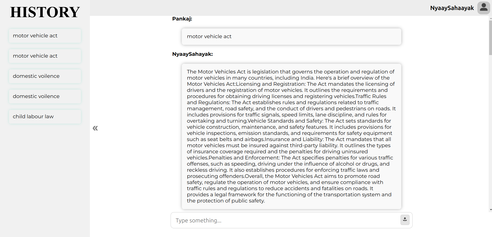
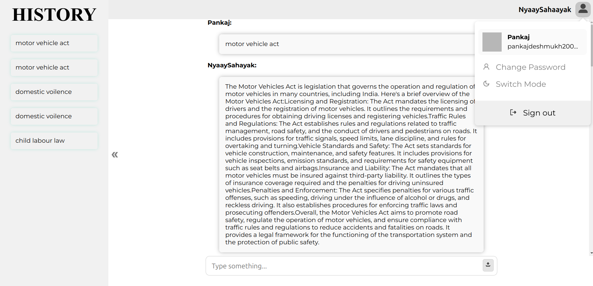
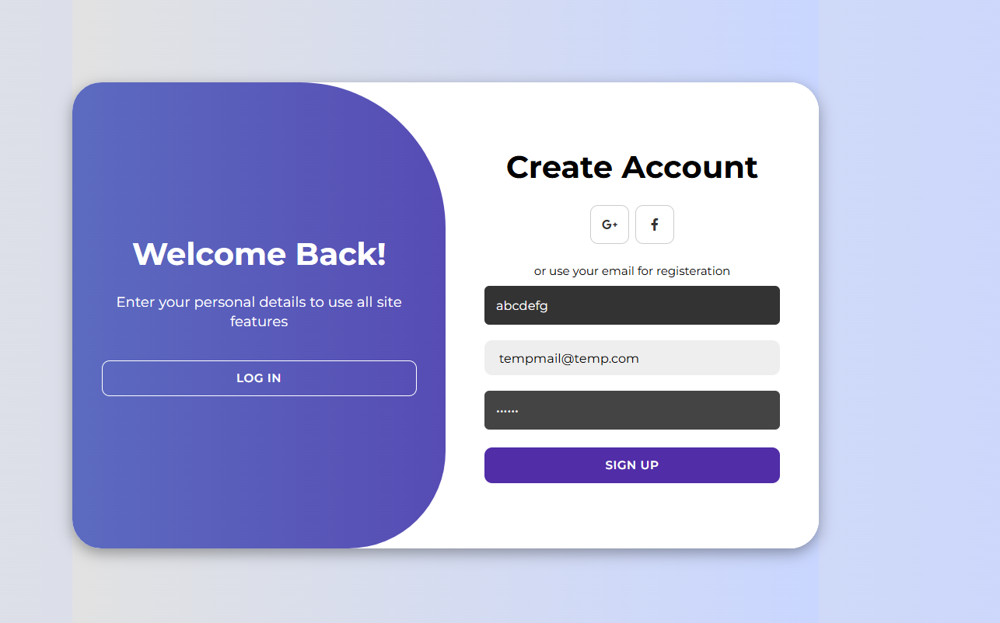

# NyaaySahaayak (Legal Assistant) ⚖️

NyaaySahaayak is a full-stack digital legal assistant designed to provide instant and reliable access to the **Indian Penal Code (IPC)**. The application emphasizes resilience and availability by ensuring that its core legal search functionality remains usable even when backend infrastructure is unavailable.

---

## 🚀 Recent Project Update: *“The Offline Resurgence”*

*After a 6-month hiatus since the last major commit, this project underwent a focused architectural enhancement aimed at improving reliability, fault tolerance, and local development experience.*

### 🔍 Background

Previously, the backend was strictly dependent on a live MongoDB connection. In environments where MongoDB was unavailable (local development, network instability, or cold starts), the application could fail to respond, preventing users from interacting with the system at all.

### ✅ Solution Overview

A **graceful degradation strategy** was introduced, **intentionally limited to the search pipeline**, allowing the application to demonstrate its core search capabilities even without a database connection.

---

## 🧠 Graceful Degradation Strategy (Search-Only)

The offline fallback is **restricted exclusively** to the following endpoint:

```
GET /api/search?query=<value>
```

### Why this approach?

- The search feature is **read-only** and does not require persistent state.
- It allows users and reviewers to observe how the **regex-based search engine works**
  without requiring MongoDB.
- Security- and state-dependent routes (authentication, user data) remain protected
  and unavailable when the database is offline.

This design preserves **data integrity and correctness** while still ensuring high availability
for the core value of the application.

---

## 🔎 Hybrid Search Engine Behavior

- **Online Mode**
  - Queries IPC sections using MongoDB via Mongoose
  - Uses MongoDB’s native `Regex` engine

- **Offline Mode**
  - Automatically falls back to a local `ipc.json` file
  - Applies equivalent JavaScript-based regex filtering
  - Ensures identical search behavior across both modes

> Users experience **no difference in search behavior**, regardless of data source.

---

## 📸 Screenshots

### 🏠 Home Screen



### 🔐 Authentication



---

## 🛠 Tech Stack

### Frontend
- React.js
- CSS Modules

### Backend
- Node.js
- Express.js

### Database
- MongoDB
- Mongoose ODM

### Security
- JWT (JSON Web Tokens)

### Data Layer
- MongoDB (Primary)
- Static IPC JSON (Search-only fallback)

---

## 🏗 Project Architecture

### 1️⃣ Database & Connectivity Layer  
**File:** `Backend/db/index.js`

This module manages database connectivity and exposes helpers used by the search route.

**Exports:**
- `isConnected` — Indicates MongoDB availability
- `getIPCData(query)` — Unified helper used by `/api/search`

**Behavior:**
- **When Online**
  - Queries the IPC collection using Mongoose and regex filters
- **When Offline**
  - Loads `ipc.json` into memory
  - Performs JavaScript-based regex filtering to mimic DB behavior

---

### 2️⃣ API Routes  
**File:** `Backend/routes/server.js`

#### 🔐 Authentication Routes
- `POST /signup`
- `POST /logg`

> These routes require persistent storage.  
> If MongoDB is offline, the API responds with a clear message indicating
> that authentication services are temporarily unavailable.

#### 🔎 Search Route
- ```http
    GET /api/search?query=<value>
A hybrid endpoint that automatically selects the best available data source
while preserving consistent search logic.

---

## 📋 Installation & Setup

### Prerequisites
- Node.js **v14+**
- MongoDB *(optional — required only for authentication features)*

---

### 📦 Setup Instructions

#### 1️⃣ Clone the Repository
```bash
git clone <repository-url>
```

#### 2️⃣ Ensure Data Availability
```
Ensure ipc.json exists in the project root directory.
```
## 3️⃣ 🚀 Getting Started

You can get the project up and running in two ways: the "Quick Start" (recommended) or manual setup.

### 1️⃣ Quick Start (One Command)
From the root directory, run the following commands:

```bash
# Install all dependencies for both Frontend and Backend
npm run install-all

# Run both services simultaneously
npm run dev
```

### 2️⃣ Manual Setup

If you prefer to run the services in separate terminals:
```
#### Backend Setup
cd Backend
npm install
node index.js

#### Frontend Setup
cd Frontend
npm install
npm start
```
### 📂 Directory Structure
```
NyaaySahaayak/
├── ipc.json                # Root IPC dataset (search fallback)
├── Backend/
│   ├── db/
│   │   └── index.js        # DB connectivity & fallback logic
│   ├── routes/
│   │   └── server.js       # Express API routes
│   └── index.js            # Server entry point
└── Frontend/               # React source code
```
### 🎯 Project Vision

NyaaySahaayak was built with a clear objective:

To make Indian legal information easily accessible, resilient, and reliable —
even in imperfect infrastructure environments.

The project prioritizes correctness, security, and transparency while demonstrating
practical backend system design and fault-tolerant architecture.